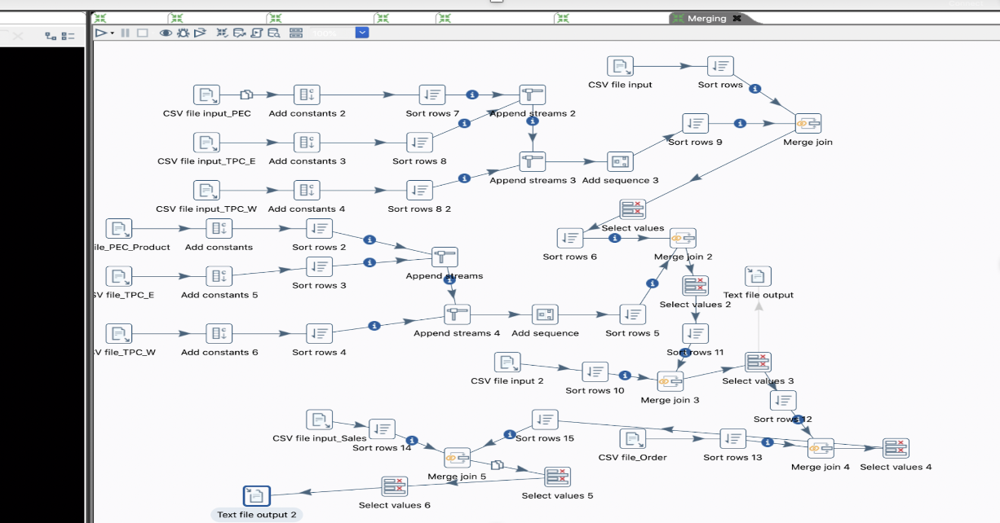
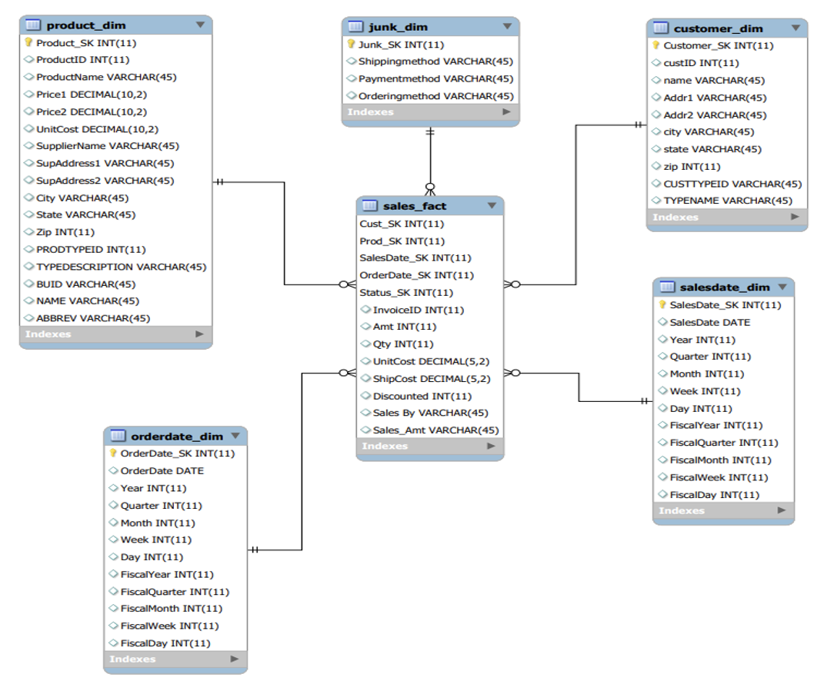

# TCP-Data-Mart-Implementation-Built-with-Pentaho-and-MySql-ETL-Process

## Built With
* Pentaho

* MySQL

## Information Packart Chart
* Process Definition: 
  * The process involves the Financial Control and Analysis of TPC-E, PEC, TPC-W divisions sales.

* Grain:
  * Individual Product Sale by every customer is analyzed.

* Dimensions and Attributes:
  * Customer_Dim: Customer_SK, custID, name, Addr1, Addr2, city, state, zip, CUSTTYPEID, TYPENAME
  * Product_Dim: Product_SK, ProductID, ProductName, Price1, Price2, UnitCost, SupplierName, SupAddress1, SupAddress2, City, State, Zip, PRODTYPEID, TYPEDESCRIPTION, BUID, NAME, ABBREV
  * Junk_Dim: Junk_SK, Shippingmethod, Paymentmethod, Orderingmethod
  * Salesdate_Dim: SalesDate_SK, SalesDate, Year, Quarter, Month, Week, Day, FiscalYear, FiscalQuarter, FiscalMonth, FiscalWeek, FiscalDay
  * Orderdate_Dim: OrderDate_SK, OrderDate, Year, Quarter, Month, Week, Day, FiscalYear, FiscalQuarter, FiscalMonth, FiscalWeek, FiscalDay

* Facts: 
  * InvoiceID
  * Amt
  * Qty
  * Discounted
  * ShipCost
  * Sales_By

## Entities
* Customer_Dim:
  * Customer dimensions exists in all the three divisions i.e.  TPC-E, TPC-W, PEC. It consists of details of the customer who had a transaction on product.

* Product_Dim:
  * It consists of details about the products that are to be sold in Product dimensions.

* Junk_Dim:
  * This dimensional table includes the attributes that do not fall into either fact or dimensional tables.

* Salesdate_Dim:
  * This dimension represents the sale date of the product by a customer.

* Orderdate_Dim
  * This dimension represents the order date of the product by a customer.

* Fact
  * It is the fact table for the schema which retrieves the facts of the model

## Data Extraction Stage
* In the ETL process, we extracted the source data from various files which were mainly in the .csv format of divisions TPC_E, TPC-W, and PEC..

* For Customer dimension, extracted source data from customer.csv, customer_type.csv, TPCWcustomer.csv, TPCWcustomer_type.csv, PECcustomer.csv, PECcustomer_type.csv.

* For Junk dimension, extracted source data from PECinvoice.csv.

* For Product dimension, extracted source data from product.csv, prod_type.csv, business_unit.csv, supplier.csv.

* For SalesDate dimension, the attribute salesdate was extracted from the invoice of all the divisions.

* For OrderDate dimension, the attribute orderdate was extracted from the invoice of all the divisions.

## Data Cleaning Stage
* Customer Dimensional KTR:
  * Cleansed: Address, Name, CustType, TYPENAME.
  
  * Standardized and made consistent:
state, city, zip code.

* Product Dimensional KTR:
  * Cleansed: Address, city, desc, SupplierName
  
  * Standardized and made consistent:
Address, city, desc, SupplierName
Included supplier in the product table.

* Junk Dimensional KTR:
  * Only present in PECinvoice and junk is created only after PEC invoice is cleaned.
 
  * Removed all attributes except Shipping method, order method and payment method.
 
  * Sort shipping method, order method and payment method in ascending order.
 
  * After removing duplicate rows so we are left with 36 records since the cardinality is 3*3*4.

* SalesDate Dimensional KTR:
  * TPCW, TPCE, PEC:
    * Remove all the attributes except Sales Date
  
    * Sort Sales Date in ascending order.
  
    * Remove Duplicated values using unique rows.

    * Calculated the following values for Year, Quarter, Month, Week, Day, FiscalYear, FiscalQuarter, FiscalMonth, FiscalWeek, FiscalDay.
  
    * According to the business constraints, the fiscal year, fiscal month, fiscal week and the fiscal day is modified.

* OrderDate Dimensional KTR:
  * TPCW, TPCE, PEC:
    * Remove all the attributes except Sales Date

    * Sort Order Date in ascending order.

    * Remove Duplicated values using unique rows.

    * Calculated the following values for Year, Quarter, Month, Week, Day, FiscalYear, FiscalQuarter, FiscalMonth, FiscalWeek, FiscalDay,
    * According to the business constraints, the fiscal year, fiscal month, fiscal week and the fiscal day is modified.

* Fact Dimension KTR:

## Data Loading Stage
The Data was then loaded in their respective data marts using MySQLWorkbench.

## Physical Model
### Physical Dimensional Model

## End-User Applications

### Querying
* End-user will be able to extract data from the data warehouse by wrtiting queries.

### Views
* Views are the perfect way to enhance database performance. They provide faster data analysis and extra sec
urity to your data.

### Aggregated Data Marts
* Following are the aggregated data marts created:
  * Lost
  
  * Shrunken
  
  * Collapsed

## Developers

* Dylan Dias - @dylandias99 - https://github.com/dylandias99

* Thulasi Armaraneni

* Kunal Joshi
